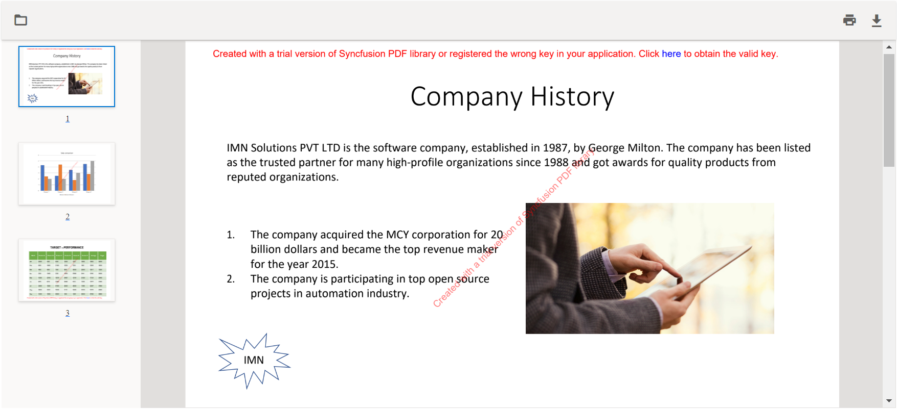

# PowerPoint Viewer in ASP.NET Core

This repository contains example that illustrates how to view the PowerPoint Presentation through PdfViewer in C# using Syncfusion [.NET&nbsp;PowerPoint library](https://www.syncfusion.com/document-processing/powerpoint-framework/net/powerpoint-library) (Presentation) and [.NET Core PDF Viewer](https://www.syncfusion.com/aspnet-core-ui-controls/pdf-viewer). This can be achieved by converting a PowerPoint presentations (PPTX) to PDF and then viewing in PDF Viewer.

In PowerPoint viewer, you can achieve the below functionality in the application.
- Browse & Open the PowerPoint Presentation (PPTX) files 
- Thumbnail view  
- Option to print the entire document or a specific page from the browser 
- Option to download the PowerPoint file as PDF 

# Syncfusion .NET PowerPoint Library
The Syncfusion [.NET PowerPoint library](https://www.syncfusion.com/document-processing/powerpoint-framework/net/powerpoint-library) (Presentation) allows you to add advanced PowerPoint presentation processing functionalities to any .NET application and does not require Microsoft PowerPoint application to be installed in the machine. It is a non-UI component that provides a full-fledged PowerPoint presentation instance model similar to the Microsoft Office COM libraries to iterate with the presentation elements explicitly and perform necessary manipulation. 

Take a moment to peruse the [documentation](https://help.syncfusion.com/file-formats/presentation/getting-started), where you can find basic PowerPoint presentation processing options along with the features like create and edit [charts](https://help.syncfusion.com/file-formats/presentation/working-with-charts), [clone](https://help.syncfusion.com/file-formats/presentation/working-with-slide#cloning-slide) and [merge](https://help.syncfusion.com/file-formats/presentation/working-with-slide#merging-slide) slides in presentation, create and edit [animations](https://help.syncfusion.com/file-formats/presentation/working-with-animation#edit-existing-animation-effect) and [transistion](https://help.syncfusion.com/file-formats/presentation/create-edit-slide-transitions-in-powerpoint-presentation-slides-cs-vb-net#modify-a-transition-effect-applied-to-a-powerpoint-slide) effects, [protect](https://help.syncfusion.com/file-formats/presentation/security) the PowerPoint presentation, and most importantly, the [PDF](https://help.syncfusion.com/file-formats/presentation/presentation-to-pdf) and [Image](https://help.syncfusion.com/file-formats/presentation/presentation-to-image) conversions with code examples.

## Compatible Microsoft PowerPoint Versions
---------------------------

- Microsoft PowerPoint 2007
- Microsoft PowerPoint 2010
- Microsoft PowerPoint 2013
- Microsoft PowerPoint 2016
- Microsoft PowerPoint 2019
- Microsoft 365

## Supported File Formats
----------------------

*   Creates, reads, and edits popular presentation file formats like .PPTX, .PPTM, .POTX, and .POTM.
*   Converts PowerPoint presentation documents also to [PDF](https://help.syncfusion.com/file-formats/presentation/presentation-to-pdf?utm_source=github&utm_medium=listing&utm_campaign=github-powerpoint-video-examples) and [Image](https://help.syncfusion.com/file-formats/presentation/presentation-to-image?utm_source=github&utm_medium=listing&utm_campaign=github-powerpoint-video-examples) files.

## How to run the examples
-----------------------

*   Download this project to a location in your disk.
*   Open the solution file using Visual Studio.
*   Rebuild the solution to install the required NuGet packages.
*   Run the application.

Resources
---------

- **Product page:** [Syncfusion PowerPoint Framework](https://www.syncfusion.com/document-processing/powerpoint-framework/net?utm_source=github&utm_medium=listing&utm_campaign=github-powerpoint-video-examples)
- **Documentation:** [Syncfusion PowerPoint library](https://help.syncfusion.com/file-formats/presentation/presentation-to-pdf/smartart?utm_source=github&utm_medium=listing&utm_campaign=github-powerpoint-video-examples)
- **GitHub Examples:** [Syncfusion PowerPoint library examples](https://github.com/SyncfusionExamples/PowerPoint-Examples?utm_source=github&utm_medium=listing&utm_campaign=github-powerpoint-video-examples)
- **Online demo:** [Syncfusion PowerPoint library - Online demos](https://ej2.syncfusion.com/aspnetcore/PowerPoint/Default#/material3?utm_source=github&utm_medium=listing&utm_campaign=github-powerpoint-video-examples)

Support and feedback
--------------------

- For any other queries, reach our [Syncfusion support team](https://support.syncfusion.com/agent/tickets/create?utm_source=github&utm_medium=listing&utm_campaign=github-powerpoint-video-examples) or post the queries through the [community forums](https://www.syncfusion.com/forums?utm_source=github&utm_medium=listing&utm_campaign=github-powerpoint-video-examples).
- Request new feature through [Syncfusion feedback portal](https://www.syncfusion.com/feedback/home?utm_source=github&utm_medium=listing&utm_campaign=github-powerpoint-video-examples).

License
-------

This is a commercial product and requires a paid license for possession or use. Syncfusion's licensed software, including this component, is subject to the terms and conditions of [Syncfusion's EULA](https://www.syncfusion.com/license/studio/22.2.5/syncfusion_essential_studio_eula.pdf). You can purchase a licnense [here](https://www.syncfusion.com/sales/products?utm_source=github&utm_medium=listing&utm_campaign=github-powerpoint-video-examples) or start a free 30-day trial [here](https://www.syncfusion.com/account/manage-trials/start-trials?utm_source=github&utm_medium=listing&utm_campaign=github-powerpoint-video-examples).

